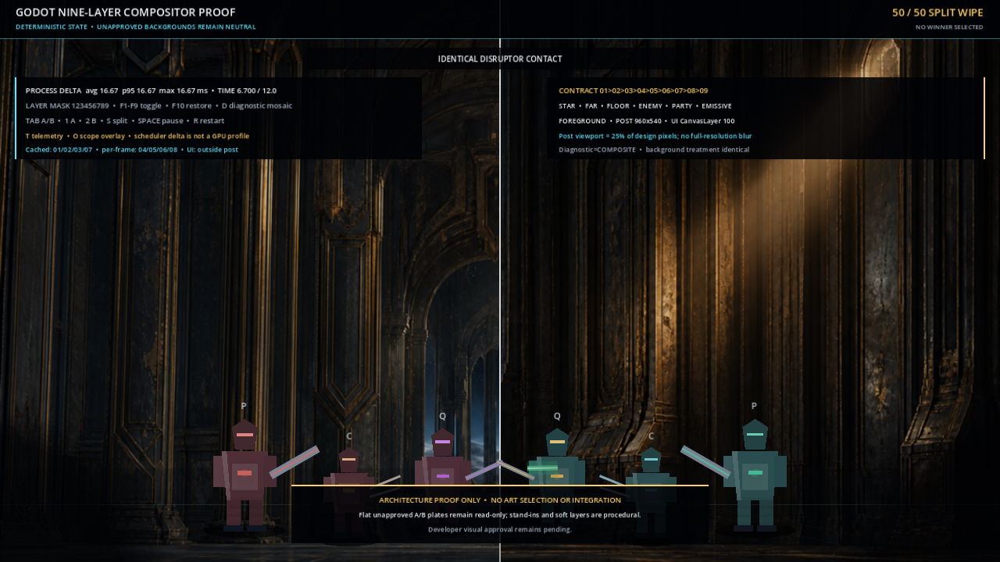
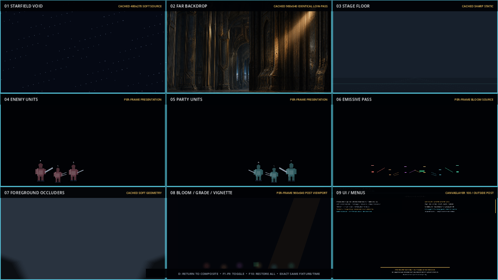

# Godot Nine-Layer Compositor Architecture Proof

Status: **isolated architecture proof complete; subjective visual approval and all
art choices remain pending**.

This proof refines `experiments/godot-visual-ab-harness/` only. It does not modify
the canonical `godot/` client, select either unapproved Empire skirmish background,
add gameplay logic, or register an art asset. Both views below use the same fixture,
split A/B source, time `6.700 s`, camera, unit positions, disruptor state, post
parameters, and UI.

| All layers composed | Diagnostic layer mosaic |
|---|---|
|  |  |

## Proven architecture

`main.tscn` exposes the semantic contract as ordered, named, grouped Godot nodes:

1. `Layer01Starfield`
2. `Layer02FarBackdrop`
3. `Layer03StageFloor`
4. `Layer04EnemyUnits`
5. `Layer05PartyUnits`
6. `Layer06EmissivePass`
7. `Layer07ForegroundOccluders`
8. `Layer08BloomGradeVignetteComposite`
9. `Layer09UI`

The first eight are exact-order children of `WorldComposition` with z indices
`0..7`. Layer 8 owns a transparent `960x540` `SubViewport`, one quarter of the
1920x1080 design-canvas pixel count. Layer 9 is a sibling `CanvasLayer` at layer
`100`, so UI is outside post-processing. Startup validation checks names, groups,
child order, z indices, post size, and UI separation and exits nonzero on failure.

`F1` through `F9` toggle the real nodes, `F10` restores them, and `D` physically
scales and positions those same nodes into the 3x3 diagnostic mosaic without
changing fixture time. Cached layers are 1, 2, 3, and 7; dynamic presentation
layers are 4, 5, 6, and 8. The UI is redrawn separately. No full-resolution
per-frame blur is present.

## Visual inspection

- The composite capture shows both neutral background halves, sharp floor overlay,
  separate enemy and party stand-ins, the live disruptor emissive line, softened
  foreground edges, the half-resolution grade/bloom/vignette overlay, and crisp UI
  above the world.
- The mosaic exposes all nine passes independently. Diagnostic-only neutral mattes
  make the naturally dark floor and foreground passes visible; those mattes are not
  drawn in composite mode.
- The far plate remains opaque, so the starfield is correctly occluded in the final
  composite and visible only when layer 2 is disabled or in the mosaic.
- No missing-resource marker, malformed texture, crop seam outside the intentional
  center split, or UI post-processing artifact was observed in the captures.
- This inspection establishes layer separation and reviewability, not production
  visual quality. The block combatants and broad procedural bloom remain stand-ins.

## Verification and measurements

Godot `4.7.2.stable.official.ed1daf0bf`, Compatibility renderer:

- four changed GDScripts: all `--check-only` exit `0`;
- headless import: exit `0`;
- composite bounded smoke: 180 frames, exit `0`;
- diagnostic bounded smoke: 60 frames, exit `0`;
- fixed scheduler delta: average/p95/max `16.667 ms`, which is command-authored
  deterministic timing and not a GPU profile;
- two-frame native composite capture on NVIDIA GeForce RTX 5080: average CPU render
  submission `0.33 ms/frame`; Godot displayed GPU time as `0.00 ms/frame` at its
  reporting precision; PNG encoding `241.19 ms/frame`;
- two-frame diagnostic capture: average CPU render submission `0.11 ms/frame`;
  displayed GPU time `0.00 ms/frame`; PNG encoding `43.12 ms/frame`.

The capture sample is too short and too encoding-heavy to establish sustained
60 fps. Startup time, memory, mobile, Web export, and browser behavior were not
measured.

Each promoted 1280x720 PNG matched its run's second paused frame byte-for-byte:

- composite SHA-256:
  `3B0707A440461FD98E1740D66CE20D0DCC02796A3E01467942E4D22A6A454D57`;
- diagnostic SHA-256:
  `3BBF737ED0D335583D74B2C5CFAA0CFBA59D367EC36BFE7E9963B8B6E8EF0E24`.

## Known limitations

- Flat unapproved A/B plates cannot prove final far/mid/floor/foreground separation,
  parallax, occlusion masks, or perspective agreement.
- Cached downsample/upscale and soft geometry are safe architectural proxies, not
  final authored depth blur.
- The half-resolution pass proves placement, sizing, and isolation but not final
  shader quality or emissive-mask workflow.
- Procedural blocks do not prove transparent sprite edges, animation states,
  anchors, sockets, scale readability, or material response.
- Read-only source plates outside `res://` keep the harness local-only and prevent a
  portable Web export.
- No art direction, background candidate, combatant direction, motion pipeline, or
  subjective visual result is approved by this evidence.
