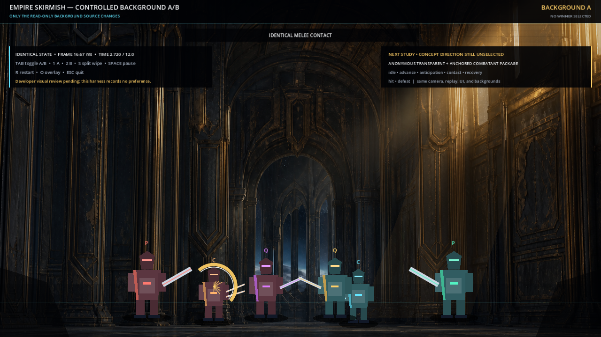
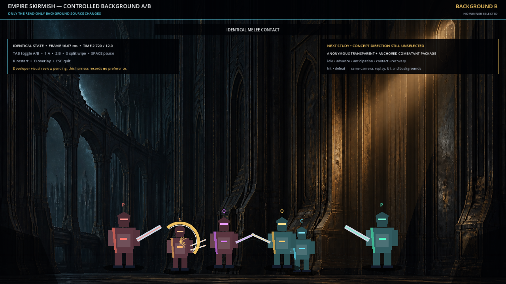

# Godot Empire Skirmish Background A/B Review

Status: **developer review pending; no winner selected**.

This is a controlled background-only comparison rendered by Godot 4.7.2 using the
Compatibility renderer. Both captures show the exact same `2.720 s` presentation
state at 1280×720. Combatant positions, idle phases, camera, grade, foreground,
grounding pass, UI, and effects are identical; only the read-only background source
changes.

| Background A | Background B |
|---|---|
|  |  |

The captured moment is inside the current melee gesture: the action begins at
`2.500 s`, contacts at `+0.100 s`, and ends at `+0.420 s`. At `2.720 s`, the actor
is near maximum travel and the authored contact arc is visible. The same fixture's
prototype disruptor baseline charges through `+0.220 s`, contacts at `+0.460 s`,
and ends at `+0.540 s` after a `0.080 s` aftermath. Long quiet holds separate the
beats so background readability can be reviewed without changing timing.

## Observable differences

These observations describe the captures; they do not rank the candidates.

- **A is more centered and enclosing.** Its nested central vault and distant opening
  establish a strong middle depth axis. That architecture frames the engagement
  lane, while also placing more high-contrast detail behind the central units and
  cross-screen effects.
- **B is more lateral and asymmetrical.** Its open, cool exterior on the left and
  tall warm wall on the right create a wider directional sweep. The center is a
  comparatively dark vertical field, while the strongest environmental contrast is
  pushed toward the outer thirds.
- **The warm-right/cool-left split is present in both.** A concentrates the warmest
  source in the upper-right window bank; B concentrates it in a narrower right-side
  shaft. The opaque UI remains readable over both because its treatment is shared,
  but the plate beneath the right review panel is more luminous than the left panel
  area in either capture.
- **Ground-plane cues differ.** A presents a more continuous reflective interior
  floor and central recession. B presents a shallower visible floor strip with more
  pronounced lateral architecture. The shared procedural glaze and shadows keep
  the stand-ins anchored, but neither flat review plate proves final layered-floor
  perspective or parallax.
- **Silhouette contrast changes locally.** The same red enemy stand-ins sit against
  different cool/dark structures, and the same cyan party stand-ins sit against
  different warm/dark structures. The contact effect remains visible in both, but
  the full loop—including the green disruptor beam—still needs developer motion
  review before a background study direction is accepted.

## Decision questions for the developer

Choose the **background study direction independently** from any later combatant or
motion-pipeline decision.

1. Which environment should advance to the next study: **A, B, or neither without
   revision**?
2. At normal 1280×720 size, which plate gives the clearest shared combat lane during
   idle, melee contact, and the disruptor beat—not only in this paused frame?
3. Which plate better grounds the six anchors and agrees with the shared
   warm-right/cool-left light direction?
4. Does either central architecture or bright window compete with target
   silhouettes, contact effects, or the top UI enough to require a composition
   revision before layer separation?
5. If one advances, is that approval **for a background study only**, with runtime
   integration still withheld until far/mid/floor/foreground layers, overscan,
   perspective, and masks are produced and verified?

Record the decision here:

- Background study direction: `[ ] A`  `[ ] B`  `[ ] neither / revise first`
- Study-only scope confirmed: `[ ] yes`
- Most important reason:
- Required background revisions before layer separation:

The future combatant gate remains deliberately separate and unresolved. After this
background choice, the developer still needs to select a party concept direction
for one **anonymous transparent, consistently anchored combatant package** covering
idle, advance, anticipation, contact, recovery, hit, and defeat. Only then should
full-frame raster motion and deliberate hybrid motion be compared on the same chosen
background and replay. This A/B review selects neither a combatant concept nor a
motion pipeline.

## Harness and reproduction

Project:
`experiments/godot-visual-ab-harness/`

Interactive launch:

```powershell
$godot = 'C:\Users\Daniel\AppData\Local\Temp\Godot_v4.7.2-stable-win64\Godot_v4.7.2-stable_win64.exe'
& $godot --path 'F:\RPG v1\experiments\godot-visual-ab-harness'
```

Use `Tab` to toggle A/B without resetting presentation time, `1` or `2` to select a
candidate, `S` for a centered split wipe, `Space` to pause, and `R` to restart. The
harness README records deterministic launch, parse, import, smoke, and capture
commands.

## Evidence provenance

- A capture: 1280×720 PNG, SHA-256
  `12366BC737295001C19E71797AD36995FB9B14448350DE72FDF2275479272FC1`.
- B capture: 1280×720 PNG, SHA-256
  `ED9E602B0247EDB1287C64ED146FB5099F4CB404B824A30205DD754EA4B6A284`.
- Both are exact binary copies of the matched Temp captures. Pixels were not
  resized, recompressed, edited, or generated again during promotion.
- Source backgrounds remain the existing proposed/unapproved 1920×1080 PNGs under
  `art/choices/backgrounds/`; this review does not change their approval status.

## Limitations

- The backgrounds are flattened review plates, not separated production layers.
- The procedural block combatants test staging and contrast only; they are not
  approved art or animation-ready assets.
- The stills do not prove motion quality, parallax, occlusion, alpha edges, sockets,
  browser/mobile performance, Web export, startup size, or audio quality/latency.
- The harness loads the unapproved source PNGs read-only from outside its `res://`
  root, so this local comparison is not a portable Web build.
- Subjective background approval remains with the developer.
